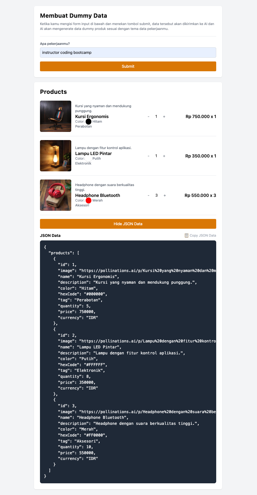

# Smart Way to Create Dummy Data v2

### See live demo:

Try demo here: [Deployed Site on Firebase](https://smart-dummy-data-v2.web.app/)

### Preview:



This project is a minimal template to demonstrate how to create dummy data for a shopping cart application. The project now uses the `text.pollinations.ai` to generate a product data, including product names, descriptions, colors, tags, quantities, and also generate a product image using the `pollinations.ai` API.

## Installation

1. Clone this repository:

    ```sh
    git clone https://github.com/Priambodo-Kurniawan/smart-dummy-data.git
    cd smart-dummy-data
    ```

2. Checkout to the `feat/text-placeholder` branch:

    ```sh
    git checkout feat/text-placeholder
    ```

3. Install dependencies:
    ```sh
    npm install
    ```

## Running the Project

To run the project in development mode, use the following command:

```sh
npm run dev
```

### Component Structure

`src/components/Cart.jsx`

-   The `Cart` component displays a list of products in the shopping cart. Each product is rendered using the `ProductCard` component.

`src/components/ProductCard.jsx`

-   The `ProductCard` component displays detailed information about a product, including an image, description, name, color, tag, and quantity.

`src/components/ProductCardLoader.jsx`

-   The `ProductCardLoader` component is used to display a loading state while the product data is being fetched.

`src/components/ImageWithFallback.jsx`

-   The `ImageWithFallback` component is used to display the product image. If the image fails to load, a fallback image is displayed.

`src/components/Form.jsx`

-   The `Form` component is used to submit job data that will be used by the AI to generate dummy products data.

`src/components/JSONViewer.jsx`

-   The `JSONViewer` component is used to display the JSON data generated by the AI.

`src/api/aiService.js`

-   The `aiService` module contains functions to interact with the `pollinations.ai` API. The `generateProductData` function is used to generate dummy product data.

`src/context/AIContext.js`

-   The `AIContext` module contains the context provider and hook for the AI service.
