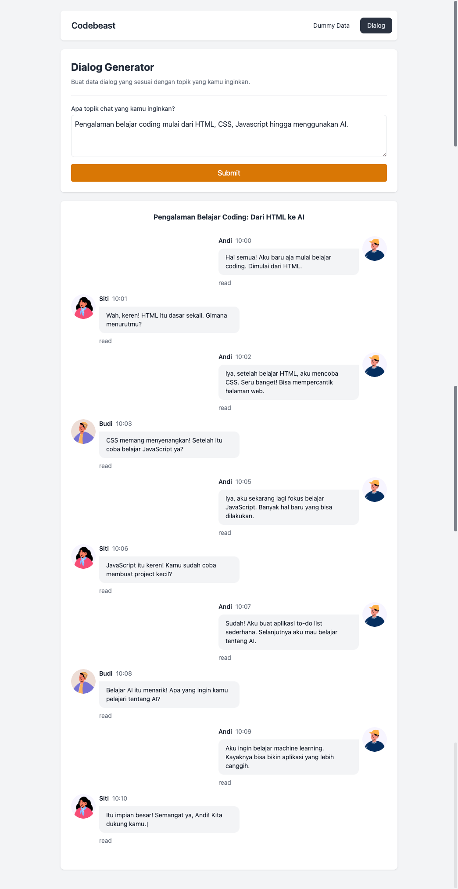

# Dialog Generator with AI

### See live demo:

Try demo here: [Deployed Site on Firebase](https://codebeast.web.app/dialog)

### Preview:



This project is a web application that generates a conversation between two / more people using an AI model. The AI model is trained on a dataset of dialogues and can generate responses based on the input message. The application allows users to interact with the chatbot by typing messages and receiving responses from the AI model.

## Installation

1. Clone this repository:

    ```sh
    git clone https://github.com/Priambodo-Kurniawan/smart-dummy-data.git
    cd smart-dummy-data
    ```

2. Checkout to the `feat/ai-conversation` branch:

    ```sh
    git checkout feat/ai-conversation
    ```

3. Install dependencies:
    ```sh
    npm install
    ```

## Running the Project

To run the project in development mode, use the following command:

```sh
npm run dev
```

### Component Structure

`src/pages/Dialog.jsx`

-   The `Dialog` page is the main page of the application. It displays the chatbot interface and allows users to interact with the chatbot.

`src/components/TextBubble.jsx`

-   The `TextBubble` component is a reusable component that displays a message in a chat bubble. It takes a `message` prop that contains the text to display.

`src/hooks/useAiPollinations.js`

-   The `useAiPollinations` hook is a custom hook that handles the interaction with the AI model. It takes a `message` as input and returns the response from the AI model.

`src/hooks/useAudio.js`

-   The `useAudio` hook is a custom hook that handles the audio playback functionality. It takes an `audioUrl` as input and returns a function to play the audio.

`Typewriter from typewriter-effect`

-   The `Typewriter` component is a reusable component that displays text with a typewriter effect. It takes a `text` prop that contains the text to display.
