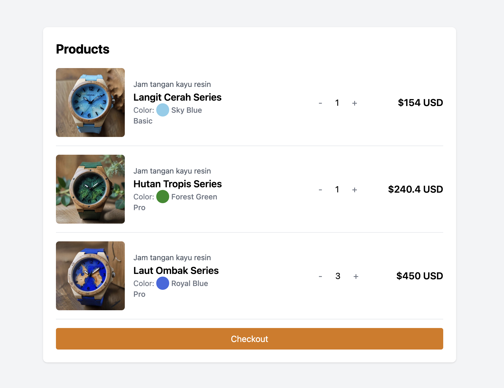

# Smart Way to Create Dummy Data

<!-- link deploy here -->

See live demo:
[Deployed Site](https://smart-way-to-create-dummy-data.netlify.app/)

preview:


This project is a minimal template to demonstrate how to create dummy data for a shopping cart application. The project uses the `chatgpt` to generate a product data, including product names, descriptions, colors, tags, and quantities. And generate a product image using the `pollinations.ai` API.

## Installation

1. Clone this repository:

    ```sh
    git clone <repository-url>
    cd <repository-directory>
    ```

2. Install dependencies:
    ```sh
    npm install
    ```

## Running the Project

To run the project in development mode, use the following command:

```sh
npm run dev
```

### Component Structure

`src/components/Cart.jsx`

-   The `Cart` component displays a list of products in the shopping cart. Each product is rendered using the `ProductCard` component.

`src/components/ProductCard.jsx`

-   The `ProductCard` component displays detailed information about a product, including an image, description, name, color, tag, and quantity.
